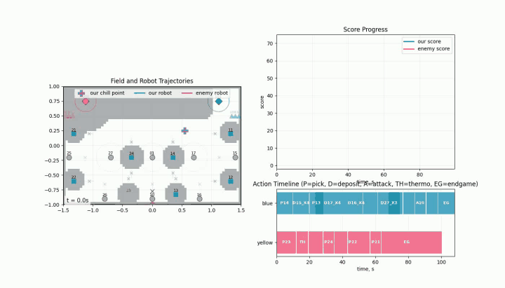

# Eurobot 2026 Planning POC

A lightweight research prototype for training a high-level planning policy for
the Eurobot 2026 game.

The repository is built around one question: can a policy learn to choose good
semantic match actions while a classical planner handles geometry, legality, and
route timing? The project models a two-robot match at the semantic-action level:
a grid/A* planner proposes legal high-level actions, a simulator executes them
as macro-actions, and a masked PPO loop trains a policy over the
planner-generated action space. The code is intentionally small enough to
inspect, run locally, and adapt for planning experiments.

## Demo



High-quality MP4 copy: [PPO policy match animation](docs/assets/ppo_policy_demo.mp4).

## What Is Included

- 2D match simulator with scoring, endgame return logic, and simplified Mars
  pantry scoring.
- Utility-based planner over an occupancy grid with route-specific waypoints.
- Scripted, stochastic, randomized, and fixed-sequence opponent policies.
- Masked discrete PPO self-play stack built on top of planner-generated action
  masks.
- Jupyter notebooks for trajectory inspection and RL result exploration.
- Focused unit tests for planner, simulator, scoring, RL infrastructure, and
  checkpoint compatibility behavior.

## Repository Layout

```text
poc/
  actions.py              # semantic action model
  rules.py                # shared game-rule predicates and capacity checks
  observations.py         # decision-point observations owned by simulation
  controllers.py          # planner, scripted, and RL action-controller protocol
  planner.py              # utility-ranked planner
  simulator.py            # match execution, event history, and decision log
  scoring.py              # scoring helpers
  rl_*.py                 # observation/action space, PPO, self-play, CLI tools
  data/                   # map and semantic map configuration
docs/
  planning_conditions.md  # planner and simulator behavior reference
  rl_system.md            # RL observation/action/training reference
notebooks/
  poc_results_overview.ipynb
  poc_rl_overview.ipynb
tests/
  test_rl_stack.py
```

## Quick Start

Requires Python 3.10 or newer.

```bash
python3 -m venv .venv
source .venv/bin/activate
python -m pip install -U pip
python -m pip install -e ".[rl,notebook]"
```

Run a single simulated match:

```bash
python -m poc.main --scenario baseline --output runs/baseline.json
```

Run a small batch:

```bash
python -m poc.main --scenario aggressive_enemy --batch 5
```

Run the test suite:

```bash
python -m pytest -q
```

## Scenarios

`poc.main` currently supports:

- `baseline`
- `delayed_sources`
- `aggressive_enemy`
- `thermo_first_enemy`
- `storage_first_enemy`
- `home_safe_enemy`
- `yellow_side_fixed_sequence_enemy`
- `stochastic_enemy`
- `uniform_random_enemy`
- `randomized_aggressive_enemy`

## RL Commands

Train a PPO policy:

```bash
python -m poc.rl_train --output-dir runs/ppo_run
```

Evaluate a checkpoint:

```bash
python -m poc.rl_eval --checkpoint runs/ppo_run/latest.pt
```

Generate an offline dataset:

```bash
python -m poc.rl_dataset --output runs/rl_dataset.jsonl
```

PyTorch is kept in the `rl` extra because the base simulator and planner do not
need it.

## Training Architecture

The learned policy does not drive motors and does not plan paths directly. It
chooses among planner-approved high-level actions such as picking a source,
depositing carried items, attacking an opponent storage zone, using the
thermometer, or starting the endgame routine.

The training loop is split into explicit layers:

- `UtilityPlanner` ranks currently legal semantic actions and attaches route
  timing, expected reward, risk, and debug metadata.
- `Simulator` advances the match as a gray-box system. At each decision point it
  records a `DecisionObservation`, the ranked action list, the chosen domain
  action, and the current score delta.
- `rl_infra` encodes `DecisionObservation` into flat policy features, builds the
  action mask from ranked actions, maps domain actions to policy tokens, and
  constructs semi-MDP transitions after the match.
- `rl_selfplay` runs masked PPO rollouts against scripted, randomized, and
  self-play opponents. Rewards are score-delta based, with optional shaping for
  successful thermometer usage and terminal win/draw/loss bonuses.
- `rl_train`, `rl_eval`, and `rl_dataset` provide training, checkpoint
  evaluation, and offline transition export CLIs.

This keeps game rules and simulation behavior out of the neural policy code, and
keeps RL rewards, masks, and transition bookkeeping out of the core simulator.

## Architecture Notes

`GameState` is the single match state. The simulator acts as the decision-point
boundary: it advances the match, builds `DecisionObservation` snapshots, and
records domain actions. RL code then encodes those observations into flat
features, masks, rewards, and transitions outside the simulator.

Shared game predicates live in `poc.rules`; policy-token labels and debug rows
live outside planner/simulator core code. Scenarios build initial state and
metadata, while controller factories choose scripted, planner-backed, or RL
action selection.

## Current Modeling Scope

Implemented:

- semantic sources, storage zones, home zones, and thermometer actions;
- endgame sequence through `chill_point -> wait -> home`;
- two large robots with runtime separation handling;
- scenario-driven external events;
- simplified Mars entities for final pantry scoring;
- stochastic enemy speed jitter;
- masked discrete PPO over a fixed semantic action space.

Simplified by design:

- no ROS 2 integration;
- no low-level motion control;
- no rigid-body physics;
- Mars entities are not yet part of dynamic planner avoidance;
- several world-state values are approximate compared with a real robot stack.

## Documentation

- [Planning Conditions](docs/planning_conditions.md)
- [RL System](docs/rl_system.md)

## License

MIT. See [LICENSE](LICENSE).
